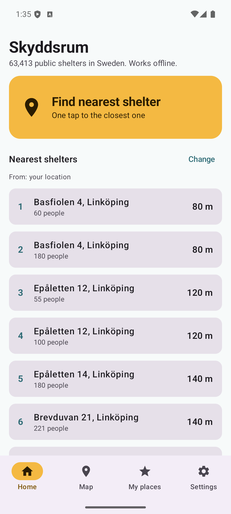
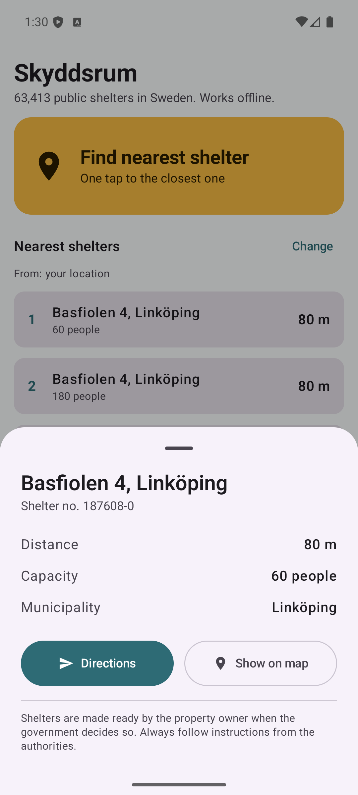
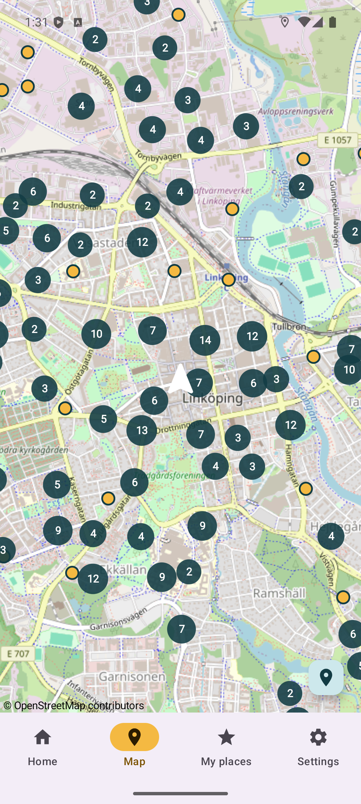

# Skyddsrum: find the nearest shelter in Sweden


**Skyddsrum** is a native Android app (Kotlin + Jetpack Compose) that finds the nearest public
air-raid shelter (*skyddsrum*) in Sweden in one tap. All **63,413 shelters** are bundled in the
app, so finding one works **without internet**.

Built for the **RevenueCat Shipaton 2026** (Next Gen Award, student category).

## Why it matters

The bundled dataset lists 63,413 public shelters with room for about 6.8 million people, but most
people don't know where their nearest one is. The information is public but spread across map services
that need a good connection. In a real emergency the network may be overloaded or down, and
people are stressed. This app is built for that situation:

- **One big button.** "Find nearest shelter" opens the closest one immediately.
- **Offline first.** The whole shelter dataset ships inside the app; the Haversine search runs on the phone.
- **Free where it counts.** Finding, listing, mapping and getting directions to shelters is
  **never paywalled**. Premium only adds convenience (saved places) and lets people support the project.
- **Swedish and English**, following the phone language.
- **No tracking, no account.** Location is used on the device only, to measure distance.

## Screenshots

| Home: 10 nearest | One tap: closest shelter | Clustered map |
|---|---|---|
|  |  |  |

## Features

| Free (core safety) | Premium (RevenueCat entitlement `premium`) |
|---|---|
| Map of all shelters with clustering (OpenStreetMap / osmdroid) | Save **Home, Work and School** |
| **Find nearest shelter**: one tap to the closest one | See the 3 nearest shelters for each saved place |
| List of the 10 nearest shelters with distance in m/km | Thank-you status in Settings |
| Fallback when location is denied: choose a municipality | |
| Shelter details: address, capacity, distance | |
| **Directions** via `geo:` intent (any maps app), with OSM web fallback | |
| Swedish and English | |

## How to run

Requirements: Android Studio (2026.1 or newer), Android SDK 37, an emulator such as **Pixel 8, API 36/37**.

1. Clone the repo and open it in Android Studio (or use the command line).
2. Add your RevenueCat **Test Store** API key to `local.properties` (this file is git-ignored):

   ```properties
   sdk.dir=/path/to/Android/Sdk
   REVENUECAT_API_KEY=test_xxxxxxxxxxxxxxxxxxxxxxxx
   ```

   The key is read by Gradle and exposed as `BuildConfig.REVENUECAT_API_KEY`
   (see [`app/build.gradle.kts`](app/build.gradle.kts)). Without a key the app still works;
   only purchases are disabled, and the app explains why.
3. Start the emulator and install:

   ```bash
   ./gradlew installDebug
   ```

4. To test location in the emulator: open **Extended controls** (the `⋯` button in the emulator
   toolbar), go to **Location**, search for *Linköping* (or enter `58.4108, 15.6214`) and press
   **Set location**.

Run the unit tests (Haversine, sorting, formatting) with `./gradlew testDebugUnitTest`.

## How RevenueCat is used

| | |
|---|---|
| SDK | `com.revenuecat.purchases:purchases` and `purchases-ui` (10.x) |
| Store | **RevenueCat Test Store**, so purchases work in the emulator without a Google Play account |
| Entitlement | `premium` |
| Offering | `default`: monthly subscription, yearly subscription and a one-time **Supporter** purchase |
| Paywall | RevenueCat Paywalls (`PaywallDialog`), designed in the RevenueCat dashboard |

Code: [`premium/Premium.kt`](app/src/main/java/io/github/intealma/skyddsrum/premium/Premium.kt)
and [`ui/SkyddsrumAppUi.kt`](app/src/main/java/io/github/intealma/skyddsrum/ui/SkyddsrumAppUi.kt).

- `Purchases.configure(...)` runs in `SkyddsrumApp.onCreate()` with the key from `BuildConfig`.
- Entitlement status comes from `CustomerInfo` (`entitlements["premium"].isActive`), both at start
  and through `UpdatedCustomerInfoListener`, and is exposed as a `StateFlow`. **Features unlock live**
  as soon as a purchase completes, with no restart needed.
- Tapping a premium feature opens `PaywallDialog` with `setRequiredEntitlementIdentifier("premium")`.
- **Settings → Support the project** always opens the paywall; **Restore purchases** calls `awaitRestore()`.

### Dashboard setup (one time)

1. Create a project at [app.revenuecat.com](https://app.revenuecat.com). Copy the **Test Store** API key
   (starts with `test_`) from *Project settings → API keys* into `local.properties`.
2. Under *Product catalog → Products*, in the Test Store, create:
   - `premium_monthly`: subscription, 1 month
   - `premium_yearly`: subscription, 1 year
   - `supporter`: one-time purchase (non-consumable)
3. Create the entitlement **`premium`** and attach all three products.
4. Create the offering **`default`** (mark it current) with packages *Monthly* → `premium_monthly`,
   *Annual* → `premium_yearly` and *Lifetime* → `supporter` (shown as "Supporter").
5. Under *Paywalls*, create a paywall for the `default` offering.

In the emulator, Test Store purchases show a RevenueCat test dialog where you choose the outcome.

## Design decisions

- **No bulk tile download.** Offline map tiles for a whole municipality were considered as a premium feature
  but dropped: the [OpenStreetMap tile usage policy](https://operations.osmfoundation.org/policies/tiles/)
  forbids bulk downloading from `tile.openstreetmap.org`. The app sets an identifying user agent,
  only loads tiles you actually view, and uses osmdroid's normal cache. The **shelter data itself is fully offline**.
- **Map performance.** 63k markers would freeze osmdroid, so a custom overlay clusters shelters on a
  Web Mercator grid per zoom level (precomputed on a background thread) and draws them directly on the canvas.
- **No Google Play services.** Location uses the platform `LocationManager`, so the app also works on
  de-Googled phones.
- **Original icon.** A shield with a house. It deliberately avoids the international civil defence sign
  (blue triangle on orange), which is a protected emblem under the Geneva Conventions.

## Data source and licenses

- **Shelter data:** Myndigheten för civilt försvar (MCF, formerly MSB), dataset *Skyddsrum*, published
  as open data through the INSPIRE download service (WFS layer `skyddsrum:US_civilProtectionSite`).
  The metadata states no conditions or restrictions on use. Municipality names were added by a spatial join
  with municipality borders. Conversion script: [`tools/convert_shelters.py`](tools/convert_shelters.py).
  The data may be out of date; always follow official information.
- **Map:** © [OpenStreetMap](https://www.openstreetmap.org/copyright) contributors, ODbL. Rendered with
  [osmdroid](https://github.com/osmdroid/osmdroid) (Apache 2.0).
- This is an independent project and **not an official app** from any authority. It uses no third-party logos.
- **Code:** [MIT License](LICENSE).
